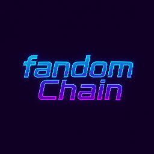

# fandomchain network



   [](https://www.linkedin.com/newsletters/7381020659008557056?lipi=urn%3Ali%3Apage%3Ad_flagship3_profile_view_base%3BckMFLApjQvyvLK8Aotl1iw%3D%3D)


FandomChain is the L1 blockchain dedicated to streamers.

The idea is simple: each streamer can create a token linked to their stream — one token per stream — to monetize their audience and diversify their revenue streams.

Meanwhile, fans can finally support their favorite creators in a direct and transparent way.

## Network info

[Fandomchain explorer](https://explorer.fandomchain.com)

[Fandomchain rpc](https://rpc.fandomchain.com)

[Fandomchain api](https://rpc.fandomchain.com)

## System Requirements

```json
    "sdk": {
      "type": "cosmos",
      "version": "v0.53.3"
    },
    "consensus": {
      "type": "cometbft",
      "version": "v0.38.17"
    },
    "ibc": {
      "type": "go",
      "version": "v10.2.0"
    },
```

## Installation

Download [ignite](https://ignite.com/) client

```bash
ignite generate proto-go --yes
go build -o fandomChaind ./cmd/fandomChaind
./fandomChaind tendermint unsafe-reset-all
ignite chain serve --reset-once 
```

## Contributing

Dont hesitate to send us an email if you want to contribute
fandomchaincontact@gmail.com